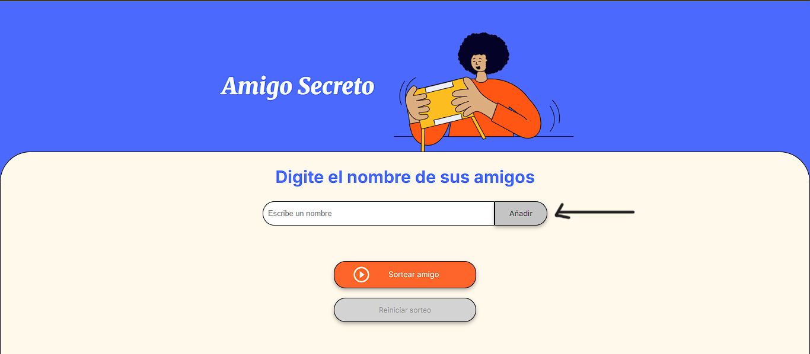
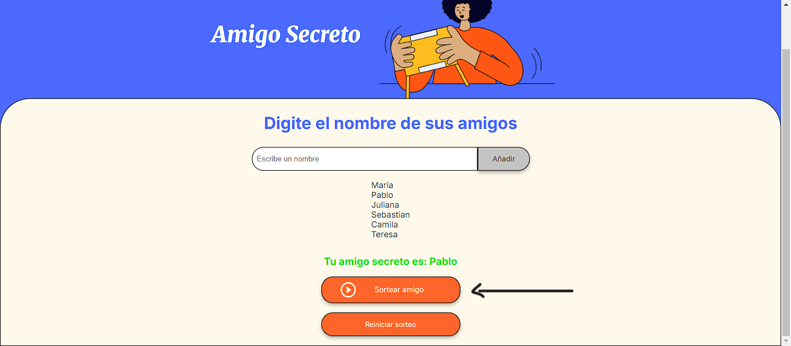
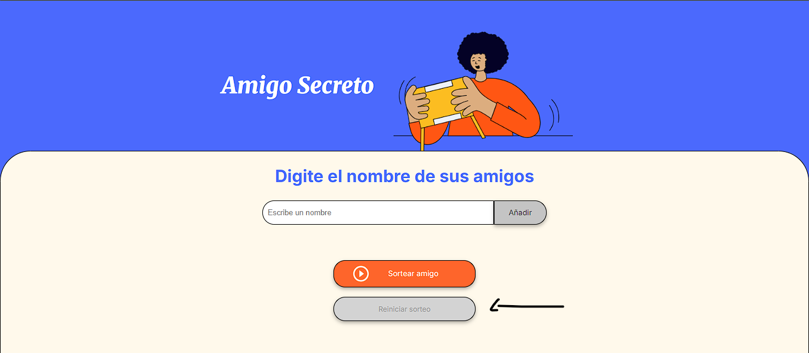

# Challenge-Amigo-Secreto-Alura

<h1 align="center">🎉 Juego Amigo Secreto 🎉</h1>
Este es un juego creado como desafío propuesto por Alura Latam para para probar los conocimientos de los cursos de principiante. En este juego el usuario tiene la oportunidad de agregar a sus amigos en una lista de amigos y luego sortear los nombres para que salga uno al azar, el cual sería su amigo secreto.

---

## 🚀 ¿Cómo jugar?

### Paso 1: Agregar amigos

1. Escribe el nombre de un amigo en el campo de texto.
2. Haz clic en el botón **"Añadir"** para agregarlo a la lista.
3. Repite este proceso hasta que todos los amigos estén en la lista.

---

### Paso 2: Sortear un amigo secreto

1. Una vez que hayas agregado al menos dos amigos, haz clic en el botón **"Sortear amigo"**.
2. El nombre del amigo secreto aparecerá en la pantalla.

---

### Paso 3: Reiniciar el sorteo

1. Si deseas realizar un nuevo sorteo, haz clic en el botón **"Reiniciar sorteo"**.
2. Esto limpiará la lista de amigos y el resultado, permitiéndote comenzar de nuevo.

---

## 📋 Reglas del juego

- **No se permiten nombres duplicados:** Si intentas agregar un nombre que ya está en la lista, recibirás una alerta.
- **Mínimo de dos amigos:** No puedes realizar el sorteo si hay menos de dos amigos en la lista.
- **Botón de reinicio desactivado:** No puedes reiniciar el sorteo si no haz hecho uno de antemano.

---

## 🛠️ Tecnologías utilizadas

- **HTML5:** Estructura del juego.
- **CSS3:** Estilos y diseño responsivo.
- **JavaScript:** Lógica del juego.

---
